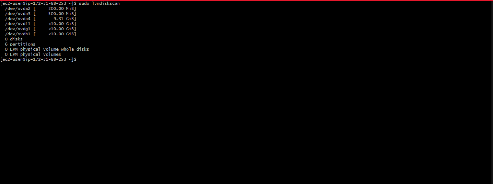
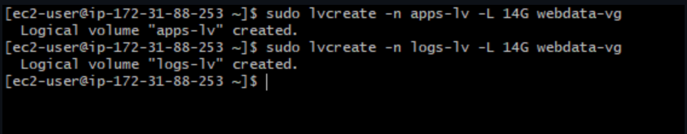

# Web-Solution-with-Wordpress

In this project we will be tasked to prepare storage infrastructure on 2 `Linux servers` and implement a basic web solution using `WordPress`.

**WordPress** is a free and open-source content management system written in `PHP` and paired with `MySQL` or `MariaDB` as its backend Relational `Database Management System (RDBMS)`.

Project 6 consists of two parts:

- Configure storage subsystem for Web and Database servers based on Linux OS. The focus of this part is to give you practical experience of working with `disks`, `partitions` and `volumes` in Linux.

- Install WordPress and connect it to a remote MySQL database server. This part of the project will solidify your skills of deploying Web and DB tiers of Web solution.

**Three-tier Architecture**

Generally, web, or mobile solutions are implemented based on what is called the Three-tier Architecture.

Three-tier Architecture is a client-server software architecture pattern that comprise of 3 separate layers.


- **Presentation Layer (PL)**: This is the user interface such as the client server or browser on your laptop.
- **Business Layer (BL)**: This is the backend program that implements business logic. Application or Webserver.
- **Data Access or Management Layer (DAL)**: This is the layer for computer data storage and data access. Database Server or File System Server such as `FTP server`, or `NFS Server`.


In this project, we will showcase **Three-tier Architecture** while also ensuring that the disks used to store files on the Linux servers are adequately partitioned and managed through programs such as `gdisk` and `LVM` respectively.

**Our 3-Tier Setup**

- A Laptop or PC to serve as a client.
- An EC2 Linux Server as a web server (This is where you will install WordPress).
- An EC2 Linux server as a database (DB) server.

We will use **RedHat OS(centos)** for this project.

**LAUNCH AN EC2 INSTANCE THAT WILL SERVE AS “WEB SERVER”**.

After logging into our `Aws console`, we go to `EC2` and click on **"volume"** under **Elastic block store(EBS)**.

Learn How to Add `EBS Volume `to an EC2 instance [here](https://www.youtube.com/watch?v=HPXnXkBzIHw)

Click on **"create volume"**


then change size to **10GiB** and click on `create volume` afterwards.


We do the same process to create three EBS volumes.


Next, we create an EC2 instance that will serve as `web server`.

We set this up by doing the following:

- create an account on [AWS](https://aws.amazon.com/).
- we create an EC2 instance by selecting **“REDHAT ENTERPRISE LINUX 9”** from Amazon Machine Image(AMI)(free tier). We will select a Redhat AMI since we are using a centos and not ubuntu.
- we select “t2.micro(free tier eligible)”.
- Select our keypair.
- then go to the security group and select “a security group” review and launch.

How to create an aws free tier account. click [here](https://www.youtube.com/watch?v=xxKuB9kJoYM&list=PLtPuNR8I4TvkwU7Zu0l0G_uwtSUXLckvh&index=8)

This launches us into the instance as shown in the screenshot:


we then attach the EBS volumes we created to the webserver Ec2 instance.


then edit the **"instance info"** with the **"instance id"** and **"device name info"** to **"/dev/xvdf"**, **"/dev/xvdg"** and **"/dev/xvdh"** for the three volumes.


then click on attach. do this for the 3 Ebs volumes created.

Open the linux terminal, connect to the instance using:

ssh -i < Your key.pem> ubuntu@<IP-address>


Open the **'/etc/hostname'**
```
vi /etc/hostname
```
replace the **"IP address"** with **"webserver"**.

click on **"ESC :wq + ENTER**

Then run the command
```
hostname webserver
```
Then disconnect and connect for changes to take effect. This process is used to identify the terminal as web server so as to differentiate it from the database server.

### Create partition on the volumes attached to the EC2 server

Use **lsblk** command to inspect what block devices are attached to the server. Notice names of your newly created devices. All devices in Linux reside in `/dev/ directory`. Inspect it with `ls /dev/` and make sure you see all 3 newly created block devices there – their names will likely be `xvdf`, `xvdh`, `xvdg`.

Type this command
```
lsblk
```


Use `df -h` command to see all mounts and free space on your server.

Use `gdisk` utility to create a single partition on each of the 3 disks
```
sudo gdisk /dev/xvdf
```
type **"?"** to display the available options. Then **"p"** "which represents print the partition table".


From the options displayed, **"n"** represents **"add a new partition"**.

Type **"n"** then **"p"** to display the new partiton table.


Type **"w"** to write table to disk


Repeat the process for the other 2 disks i.e  `/dev/xvdg` and `/dev/xvdh`.

Use lsblk utility to view the newly configured partition on each of the 3 disks.
```
lsblk
```


### create Physical volumes on the configured partitions on the instance 

Install lvm2 package using
```
sudo yum install lvm2
```


Run
```
sudo lvmdiskscan 
```
to check for available partitions.



Use pvcreate utility to mark each of 3 disks as physical volumes (PVs) to be used by `LVM`.
```
sudo pvcreate /dev/xvdf1
```
```
sudo pvcreate /dev/xvdg1
```
```
sudo pvcreate /dev/xvdh1
```


Verify that your Physical volume has been created successfully by running
```
sudo pvs
```


Use vgcreate utility to add all 3 PVs to a volume group (VG). Name the VG **webdata-vg**
```
sudo vgcreate webdata-vg /dev/xvdh1 /dev/xvdg1 /dev/xvdf1
```
Verify that your VG has been created successfully by running
```
sudo vgs
```


### Create Logical volumes out of the volume group

Use lvcreate utility to create 2 logical volumes. **apps-lv** (Use half of the PV size), and **logs-lv** (Use the remaining space of the PV size).

The **apps-lv** will be used to store data for the Website while, **logs-lv** will be used to store data for logs.
```
sudo lvcreate -n apps-lv -L 14G webdata-vg
```
```
sudo lvcreate -n logs-lv -L 14G webdata-vg
```


Verify that your Logical Volume has been created successfully by running
```
sudo lvs
```


Verify the entire setup
```
sudo vgdisplay -v #view complete setup - VG, PV, and LV
```
```
sudo lsblk
```


Use **"mkfs.ext4"** to format the logical volumes with **"ext4"** filesystem
```
sudo mkfs -t ext4 /dev/webdata-vg/apps-lv
```
```
sudo mkfs -t ext4 /dev/webdata-vg/logs-lv
```


Create **"/var/www/html"** directory to store website files
```
sudo mkdir -p /var/www/html
```
Create **/home/recovery/logs** to store backup of log data
```
sudo mkdir -p /home/recovery/logs
```
Mount "/var/www/html" on "apps-lv" logical volume
```
sudo mount /dev/webdata-vg/apps-lv /var/www/html/
```

Use rsync utility to backup all the files in the log directory **"/var/log" into "/home/recovery/logs"**. This reqiured before mounting the file system.
```
sudo rsync -av /var/log/. /home/recovery/logs/
```


Mount **"/var/log"** on **"logs-lv"** logical volume. (all the existing data on "/var/log" will be deleted).
```
sudo mount /dev/webdata-vg/logs-lv /var/log
```
Restore log files back into "/var/log" directory.
```
sudo rsync -av /home/recovery/logs/. /var/log
```


Update **"/etc/fstab file"** so that the mount configuration will persist after restart of the server.

### UPDATE THE "/ETC/FSTAB" FILE.

The UUID of the device will be used to update the /etc/fstab file;

check for the UUID with this command
```
sudo blkid
```


Open the **"/etc/fstab"**
```
sudo vi /etc/fstab
```
Update **/etc/fstab** in this format using your own UUID and rememeber to remove the leading and ending quotes.


Test the configuration by running this command. There will be no errors if everything is ok.
```
sudo mount -a
```
Reload the daemon
```
sudo systemctl daemon-reload
```
Verify your setup by running
```
df -h
```


### PREPARE THE DATABASE SERVER.

Launch a second `RedHat EC2 instance` that will have a role – **‘DB Server’** Repeat the same steps as for the Web Server, but instead of **apps-lv** create **db-lv** and mount it to **/db directory** instead of **/var/www/html/**.

The `db-lv` will be used to store data for the database while, `logs-lv` will be used to store data for logs.
```
sudo lvcreate -n db-lv -L 14G webdata-vg
```
```
sudo lvcreate -n logs-lv -L 14G webdata-vg
```
Verify that your Logical Volume has been created successfully by running
```
sudo lvs
```


Verify the entire setup
```
sudo vgdisplay -v #view complete setup - VG, PV, and LV
```


```
sudo lsblk
```


Use **mkfs.ext4** to format the logical volumes with **ext4 filesystem**.
```
sudo mkfs -t ext4 /dev/webdata-vg/db-lv
```
```
sudo mkfs -t ext4 /dev/webdata-vg/logs-lv
```


Create db directory to store database files
```
sudo mkdir db
```
Create /home/recovery/logs to store backup of log data
```
sudo mkdir -p /home/recovery/logs
```
Mount db/ on db-lv logical volume
```
sudo mount /dev/webdata-vg/db-lv db/
```
Use rsync utility to backup all the files in the log directory /var/log into /home/recovery/logs (This is required before mounting the file system).
```
sudo rsync -av /var/log/. /home/recovery/logs/
```
Mount /var/log on logs-lv logical volume. (all the existing data on /var/log will be deleted.)
```
sudo mount /dev/webdata-vg/logs-lv /var/log
```
Restore log files back into /var/log directory
```
sudo rsync -av /home/recovery/logs/. /var/log
```


The UUID of the device will be used to update the /etc/fstab file;
```
sudo blkid
```


Open the "/etc/fstab" file.
```
sudo vi /etc/fstab
```
Update "/etc/fstab" in this format using your own UUID and rememeber to remove the leading and ending quotes.


Test the configuration for errors.
```
sudo mount -a
```
Reload daemon
```
sudo systemctl daemon-reload
```
Verify your setup by running
```
df -h
```


### Webserver installation

Open the linux terminal, connect to the instance using:

ssh -i < Your key.pem> ubuntu@<IP-address>

Install WordPress on your Web Server EC2

Update the repository
```
sudo yum -y update
```


Install wget, Apache and it’s dependencies
```
sudo yum -y install wget httpd php php-mysqlnd php-fpm php-json
```


Start Apache
```
sudo systemctl start httpd
```
Enable Apache
```
sudo systemctl enable httpd
```
Verify Apache status
```
sudo systemctl status httpd
```


To install PHP and it’s dependencies
```
sudo yum install https://dl.fedoraproject.org/pub/epel/epel-release-latest-8.noarch.rpm
```
```
sudo yum install yum-utils http://rpms.remirepo.net/enterprise/remi-release-8.rpm
```
```
sudo yum module list php
```
```
sudo yum module reset php
```
```
sudo yum module enable php:remi-7.4
```
```
sudo yum install php php-opcache php-gd php-curl php-mysqlnd
```


Start php and set policies
```
sudo systemctl start php-fpm
```
Enable php
```
sudo systemctl enable php-fpm
```
verify php status
```
sudo systemctl status php-fpm
```
```
sudo setsebool -P httpd_execmem 1
```
Restart Apache
```
sudo systemctl restart httpd
```


Copy the IP address of the webserver to the browser to see that the apache is working properly


**Download wordpress and copy wordpress to "var/www/html"**

Create directory wordpress and cd into the directory.
```
mkdir wordpress
```
```
cd wordpress
```
Download the wordpress file
```
sudo wget http://wordpress.org/latest.tar.gz
```
Unzip the file
```
sudo tar xzvf latest.tar.gz
```


```
sudo rm -rf latest.tar.gz
```
Copy "wordpress/wp-config-sample.php" into "wordpress/wp-config.php"

> [!NOTE] wordpress/wp-config.php" will be created.
```
sudo cp wordpress/wp-config-sample.php wordpress/wp-config.php
```
Copy wordpress into "/var/www/html".
```
sudo cp -R wordpress/* /var/www/html/
```


Configure SELinux Policies
```
sudo chown -R apache:apache /var/www/html/
```
```
sudo chcon -t httpd_sys_rw_content_t /var/www/html/ -R
```
```
sudo setsebool -P httpd_can_network_connect=1
```
```
sudo setsebool -P httpd_can_network_connect_db 1
```


### Database Installation

Install MySQL on your DB Server EC2

Update the repository
```
sudo yum update -y
```


Install mysql-server
```
sudo yum install mysql-server
```


Verify that the service is up and running, if it is not running, restart the service and enable it so it will be running even after reboot:
```
sudo systemctl restart mysqld
```
```
sudo systemctl enable mysqld
```
```
sudo systemctl status mysqld
```


### Configure DB to work with WordPress
```
sudo mysql
```
```
mysql> ALTER USER 'root'@'localhost' IDENTIFIED WITH mysql_native_password BY 'PassWord.1';
```
```
mysql> exit;
```
Install mysql_secure_installation for security
```
sudo mysql_secure_installation
```


**Create a database**

```
sudo mysql -p
```
```
mysql> CREATE DATABASE `wordpress`;
```
**Create a user**

```
mysql> CREATE USER 'myuser'@'%' IDENTIFIED WITH mysql_native_password BY 'S**la@@zaa';
```
```
mysql> GRANT ALL ON example_database.* TO 'myuser'@'%';
```
```
mysql> exit;
```
**Login to the database with the new user created**
```
mysql -u example_user -p
```
```
mysql> SHOW DATABASES;
```


Open `MySQL` `port 3306` on `DB Server EC2`. For extra security, you shall allow access to the DB server `ONLY` from your `Web Server’s IP address`, so in the Inbound Rule configuration specify source as the server EC2 primary ip address


